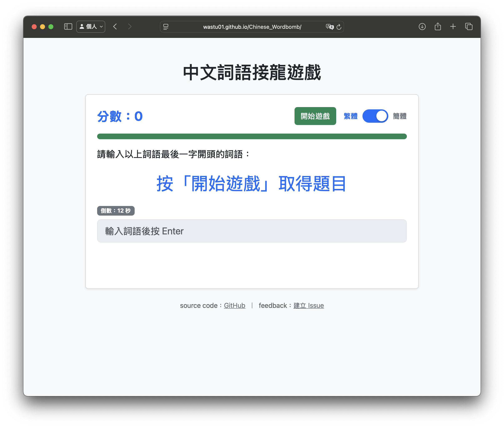

# Chinese Wordbomb

中文詞語接龍遊戲

[https://wastu01.github.io/Chinese_Wordbomb/](https://wastu01.github.io/Chinese_Wordbomb/)

## Gameplay

- 按下開始後，以題目最後一個字接龍，在限定秒數內輸入正確詞語累積連擊與分數。
- 遊戲結束後可輸入玩家名稱，將分數登錄至後台資料庫，以便日後統整排行榜。（目前沒有比對是否同個玩家）

## Project Layout

- `index.html` - main page that can play chinese vocab game

- `dict_moedict.json` — 從 [萌典](https://github.com/g0v/moedict-webkit) 開放資料原始轉出，未過濾版本。
- `dict_moedict_clean.json` — 由 `dict_moedict.json` 轉檔後的繁體精簡詞表。
- `dict_moedict_clean_s.json` — 由 `dict_moedict.json` 轉檔後的簡體對應詞表。

- `second.html` not finished yet.

to-do :

- 新增簡單模式（切換不同的資料集資料庫）。
- 主題模式（依萌典主題分類的詞彙資料集）。
- 排行榜顯示前十名。

document : [https://docs.google.com/document/d/1CGkAbbTZCINa-pF4idxS0LFFWCHu8UbEOGN68IiWiZU/edit?usp=sharing](https://docs.google.com/document/d/1CGkAbbTZCINa-pF4idxS0LFFWCHu8UbEOGN68IiWiZU/edit?usp=sharing)

## Data Source and License

Vocabulary data originates from the [g0v moedict-webkit project](https://github.com/g0v/moedict-webkit) and additional collection notes are maintained at [https://github.com/wastu01/chinese_dictionary_collection](https://github.com/wastu01/chinese_dictionary_collection). All datasets are released under the **CC0 1.0 公眾領域貢獻宣告**. As required, please review:

- https://creativecommons.org/publicdomain/zero/1.0/deed.zh_TW
- http://wiki.creativecommons.org.tw/cc-zero-1-0:pre-final
