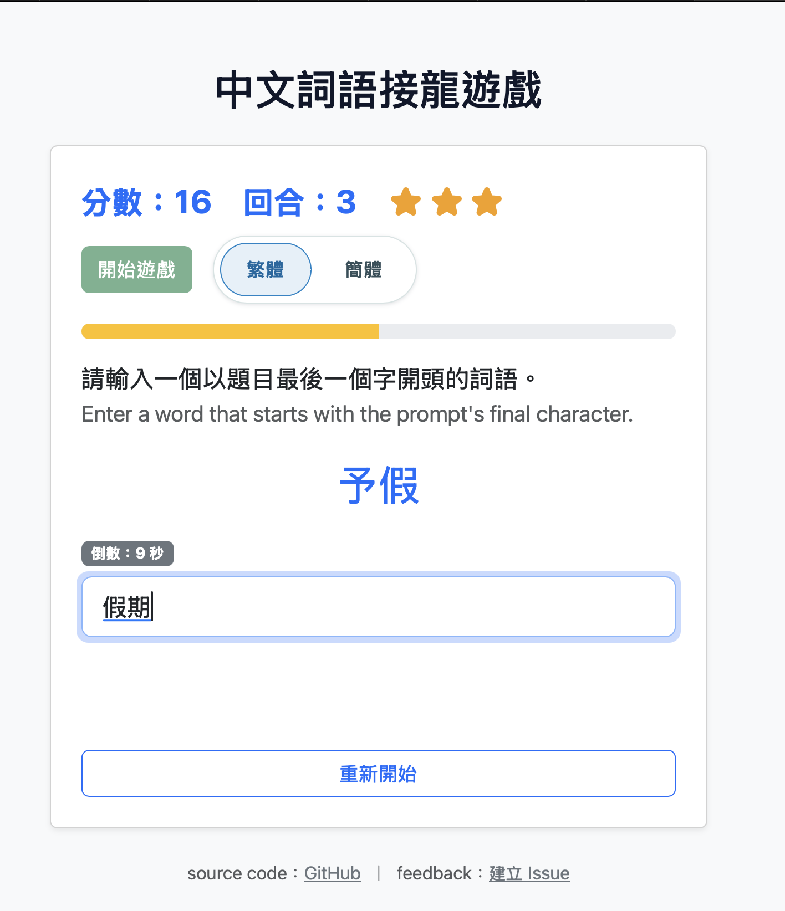

# Chinese Wordbomb

中文詞語接龍遊戲

[https://wastu01.github.io/Chinese_Wordbomb/](https://wastu01.github.io/Chinese_Wordbomb/)

## Project Layout

- `index.html` - main page that can play chinese vocab game

- `dict_moedict_clean.json` — Reference dictionaries derived from the [萌典](https://github.com/g0v/moedict-webkit) open data dump.

- `dict_moedict_clean_s.json` simplified chinese version.

- `second.html` not finished yet.

to-do : 

username, score, combo time 放進 google sheet 中
讀取資料庫，顯示排行榜的頁面
--> GAS 有無排序的語法
--> 或是先撈資料再前端排序

add multiplayer mode.

document : [https://docs.google.com/document/d/1CGkAbbTZCINa-pF4idxS0LFFWCHu8UbEOGN68IiWiZU/edit?usp=sharing](https://docs.google.com/document/d/1CGkAbbTZCINa-pF4idxS0LFFWCHu8UbEOGN68IiWiZU/edit?usp=sharing)

## Data Source and License

Vocabulary data originates from the [g0v moedict-webkit project](https://github.com/g0v/moedict-webkit), which is released under the **CC0 1.0 公眾領域貢獻宣告**. As required, please review:

- https://creativecommons.org/publicdomain/zero/1.0/deed.zh_TW
- http://wiki.creativecommons.org.tw/cc-zero-1-0:pre-final
